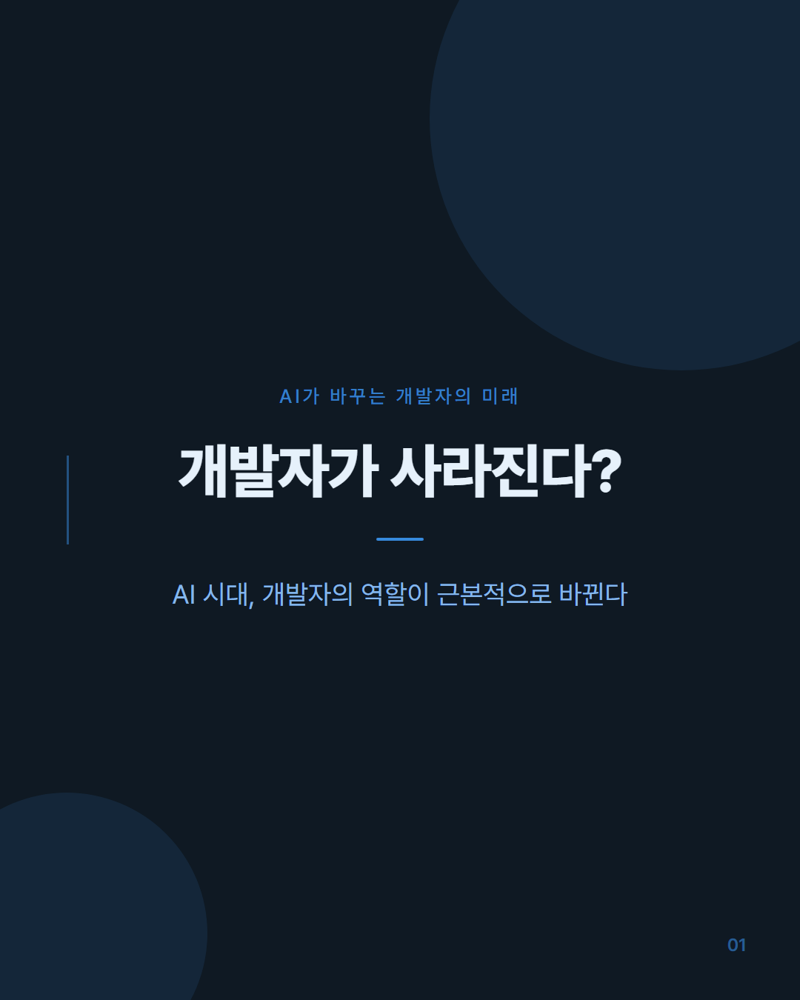
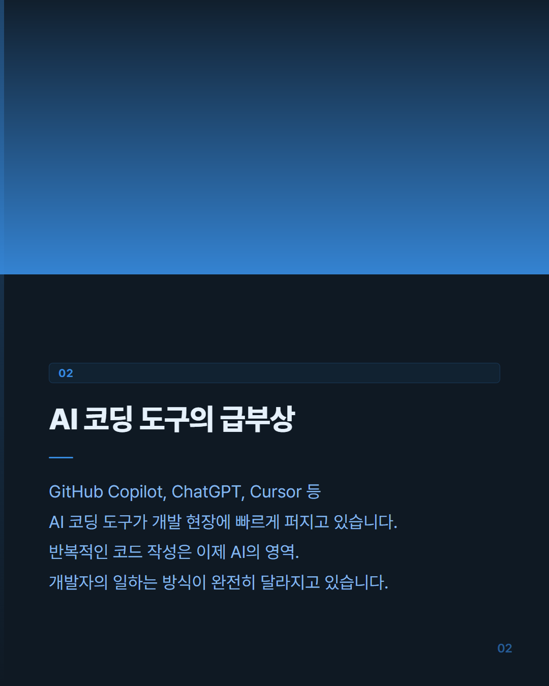
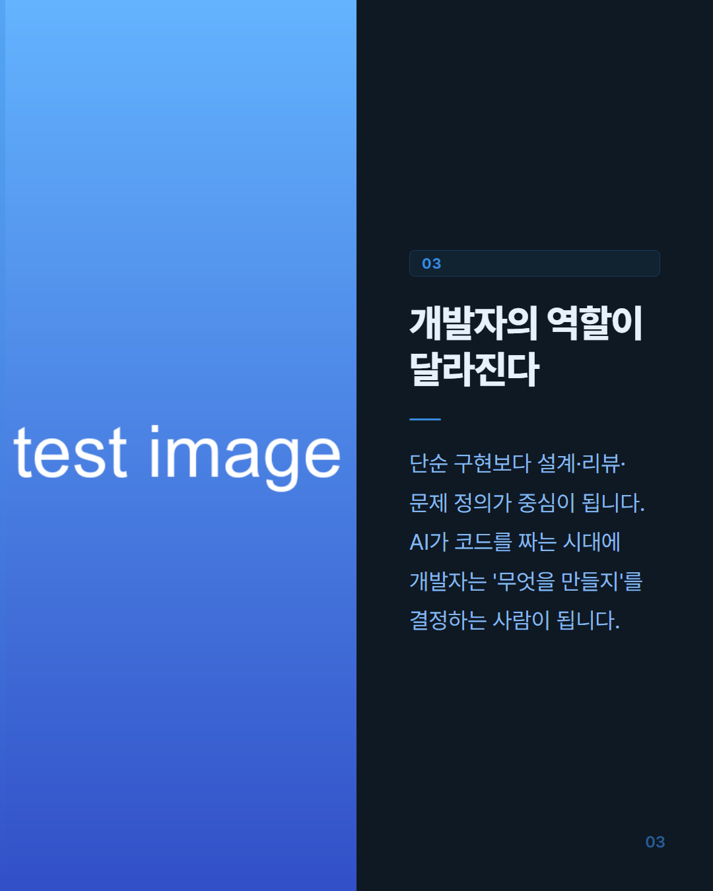
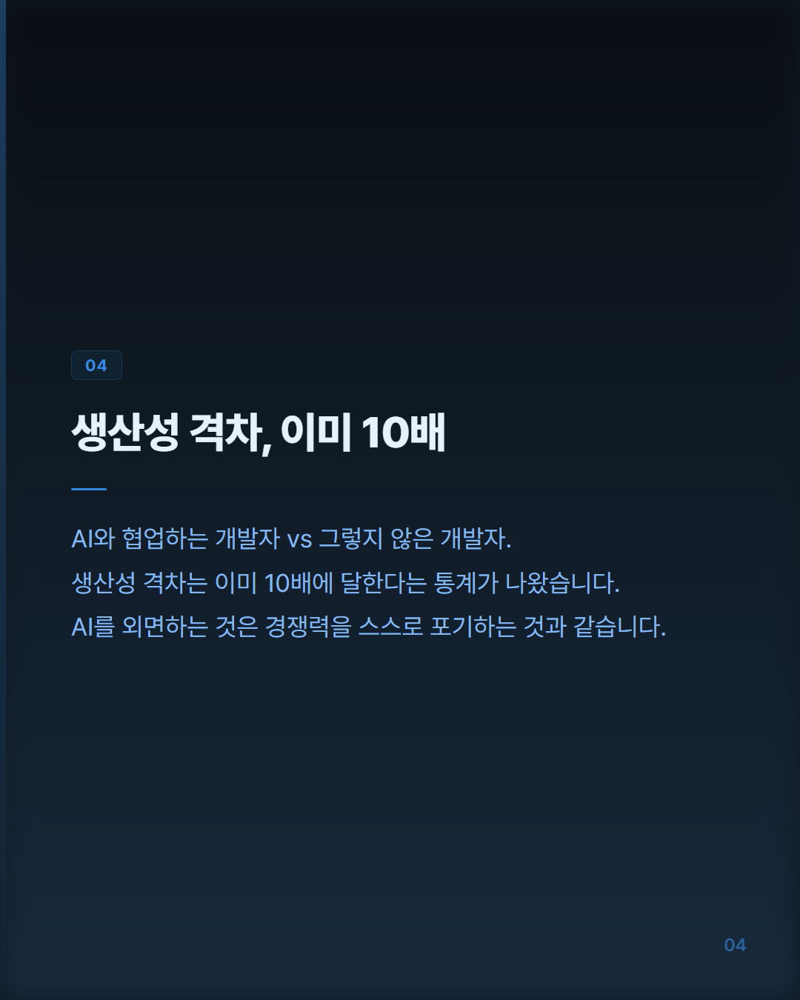
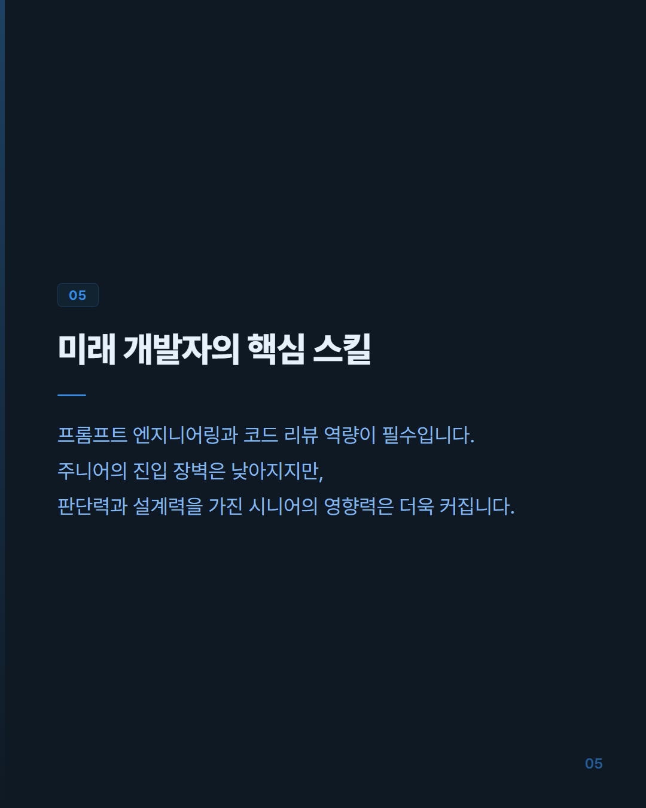
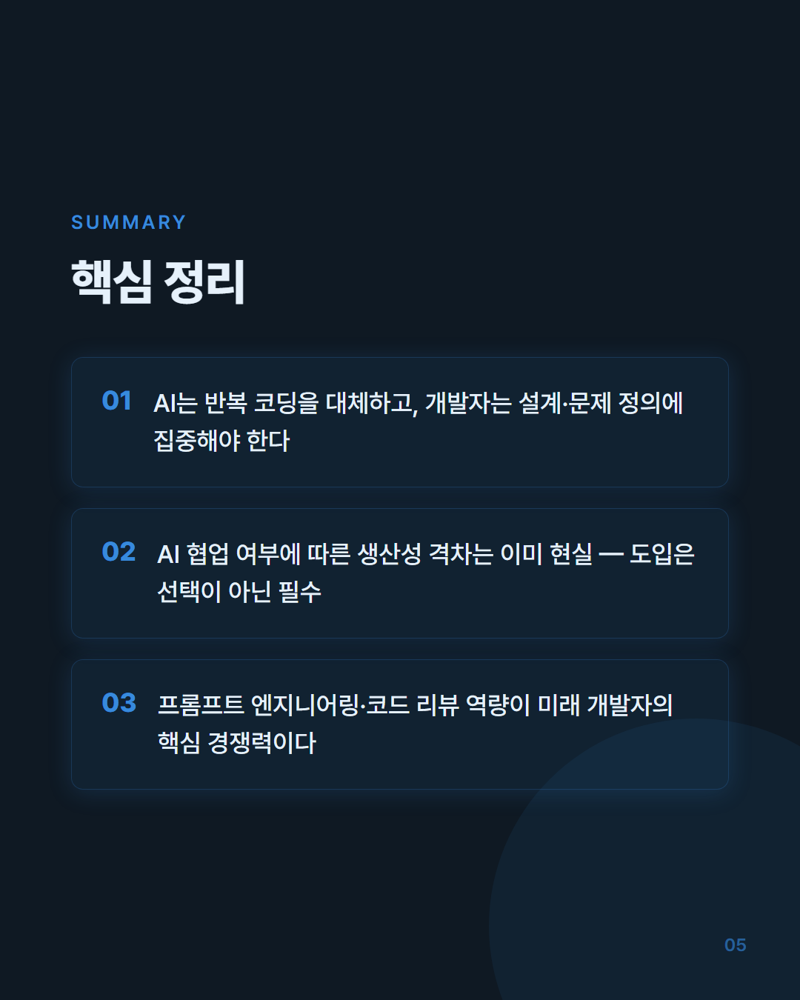

# Instagram Card News Automation

Claude Code CLI + Playwright 기반 인스타그램 카드뉴스 자동 생성 파이프라인. 

<br>

> 테마: `tech` / 주제: AI가 바꾸는 개발자의 미래

| 커버 | 본문 1 (image-top) | 본문 2 (image-split) | 본문 3 (image-blur-bg) |
|------|-------------------|----------------------|------------------------|
|  |  |  |  |

| 본문 4 (text-only) | 요약 | CTA |
|--------------------|------|-----|
|  |  |  |

<br>

## 1. 주요 기능
- 슬라이드 텍스트 자동 생성 — Claude Code CLI가 원문을 분석해 커버 훅 문구, 본문, 요약 텍스트를 JSON으로 생성
- Unsplash 이미지 자동 삽입 — Claude가 생성한 `image_query`로 Unsplash에서 이미지를 자동 검색·다운로드
- 이미지 혼용 지원 — `images/` 폴더에 직접 추가한 파일이 있으면 우선 사용, 없는 슬라이드만 Unsplash로 채움
- HTML 미리보기 — PNG 변환 전 브라우저에서 결과물을 먼저 확인
- 인터랙티브 재생성 — 미리보기 후 피드백을 입력하면 Claude가 반영해서 재생성 (반복 가능)
- HTML 직접 편집 지원 — output/html/ 파일을 직접 수정한 뒤 PNG로 변환
- 레이아웃 자동 선택 — 이미지 비율(가로형/정방형/세로형)을 감지해 최적 레이아웃 적용
- 슬라이드 수 동적 조정 — 원문 분량에 따라 전체 슬라이드 6~8장 자동 결정
- 3가지 테마 — info (딥 퍼플) / life (웜 코럴) / tech (나이트 블루)
- 고해상도 PNG 캡처 — Playwright로 인스타그램 규격 1080×1350px 자동 캡처

<br>

## 2. 설치 및 실행방법

### 2-1. 사전 요구 사항

- Python 3.10+
- [Claude Code CLI](https://github.com/anthropics/claude-code) (`npm install -g @anthropic-ai/claude-code`)
- Claude Code 로그인 완료 (`claude` 명령어 실행 가능 상태)
- Unsplash 계정 및 Access Key (이미지 자동 삽입 시 필요, [Unsplash Developers](https://unsplash.com/developers) 에서 발급)

<br>

### 2-2. 설치

```bash
pip install -r requirements.txt
playwright install chromium
```

<br>

### 2-3. 환경변수 설정

Unsplash 이미지 자동 다운로드를 사용하려면 프로젝트 루트에 `.env` 파일을 생성하고 Access Key를 입력합니다.

```
UNSPLASH_ACCESS_KEY=여기에_키_입력
```

키를 설정하지 않아도 `images/` 폴더에 직접 파일을 추가하면 이미지를 사용할 수 있습니다.

<br>

### 2-4. 사용법

```bash
python main.py --theme <테마> --topic <주제> --text <원문>
```

| 옵션 | 필수 | 설명 |
|------|------|------|
| `--theme` | ✓ | `info` / `life` / `tech` |
| `--topic` | ✓ | 카드뉴스 제목 / 주제 |
| `--text`  | ✓ | 슬라이드 생성에 사용할 원문 |
| `--unsplash-key` | — | Unsplash Access Key (`.env` 설정 시 생략 가능) |
| `--capture-only` | — | `output/html/` 의 HTML을 바로 PNG로 변환 |

<br>

### 2-5. 테마

| `info` | `life` | `tech` |
|--------|--------|--------|
|  |  |  |
| 딥 퍼플 #1A1A2E / #7F77DD | 웜 코럴 #FFF8F5 / #D85A30 | 나이트 블루 #0F1923 / #378ADD |

<br>

### 2-6. 이미지 사용

이미지 소스는 두 가지를 혼용할 수 있으며, 모두 `images/` 폴더 하나로 통합 관리됩니다.

**직접 추가**: `images/` 폴더에 슬라이드 인덱스에 맞게 파일을 넣으면 해당 슬라이드에 우선 적용됩니다. Unsplash 키 없이도 동작합니다.

```
images/
  slide1.jpg   # 커버에 적용
  slide3.png   # 본문 슬라이드 3에 적용 (.png / .webp 도 가능)
```

**Unsplash 자동**: `.env`에 키를 설정하면 `images/`에 파일이 없는 슬라이드 중 Claude가 `image_query`를 생성한 슬라이드를 Unsplash에서 자동으로 채웁니다.

슬라이드별 이미지 결정 우선순위:

```
images/slideN.* 있음  →  직접 추가한 파일 사용
없음 + Unsplash 키 있음 + image_query 있음  →  Unsplash 자동 다운로드
없음 + 그 외  →  텍스트 전용
```

이미지 비율에 따라 레이아웃이 자동 선택됩니다.

| 비율 (가로/세로) | 레이아웃 |
|---------|---------|
| >= 1.5 (가로형) | image-top |
| 0.85 ~ 1.5 (정방형) | image-split |
| < 0.85 (세로형) | image-blur-bg |

<br>

### 2-7. 사용 예시

```bash
python main.py \
  --theme info \
  --topic "AI가 바꾸는 개발자의 미래" \
  --text "최근 GitHub Copilot, ChatGPT 등 AI 코딩 도구가 급속히 보급되면서..."
```

<br>

## 3. 실행 흐름

```
[1/3]   Claude API로 슬라이드 텍스트 생성
[1.5/3] 이미지 준비 (직접 추가 파일 우선 → 나머지 Unsplash 자동 다운로드)
[2/3]   HTML 슬라이드 렌더링 → 브라우저 미리보기

PNG로 변환하시겠습니까?
  [y] PNG 변환
  [r] 다시 생성 (Claude에게 피드백)
  [e] HTML 직접 수정 후 변환
  [n] 취소

[3/3]   Playwright PNG 캡처 → output/ 저장
```

| 선택 | 동작 |
|------|------|
| `y` | PNG 변환 후 `output/` 에 저장 |
| `r` | 피드백을 입력하면 Claude가 반영해서 재생성, 이미지도 재준비 후 미리보기 다시 열림 |
| `e` | `output/html/` 의 HTML 파일을 직접 편집 후 엔터를 누르면 PNG 변환 |
| `n` | HTML은 `output/html/` 에 보관, PNG 변환 없이 종료 |

<br>

### HTML 수정 후 나중에 PNG 변환

`output/html/` 의 HTML을 수정해둔 상태에서 언제든 PNG로 변환할 수 있습니다.

```bash
python main.py --capture-only
```

<br>


## 4. 슬라이드 구성

원문 분량에 따라 전체 슬라이드 수가 6~8장으로 자동 조정됩니다.

| 슬라이드 | 종류 | 설명 |
|---------|------|------|
| 01 | 커버 | 훅 문구 + 부제목 |
| 02-04 / 02-05 / 02-06 | 본문 | 제목 + 본문, 원문 분량에 따라 3~5장 |
| N | 요약 | 핵심 요점 3가지 |
| N+1 | CTA | 고정 (팔로우 유도) |

| 본문 장수 | 전체 슬라이드 수 |
|----------|--------------|
| 3장 (02~04) | 6장 |
| 4장 (02~05) | 7장 |
| 5장 (02~06) | 8장 |

<br>

## 5. 프로젝트 구조

```
.
├── main.py            # CLI 진입점
├── generator.py       # Claude Code CLI로 슬라이드 텍스트 생성
├── image_fetcher.py   # Unsplash 이미지 다운로드
├── renderer.py        # Jinja2 HTML 렌더링 + 레이아웃 선택
├── capture.py         # Playwright PNG 캡처
├── images/            # 이미지 소스 폴더 (직접 추가 + Unsplash 다운로드)
├── templates/
│   ├── cover.html
│   ├── body.html
│   ├── summary.html
│   └── cta.html
├── themes/
│   ├── info.css
│   ├── life.css
│   └── tech.css
├── .env               # Unsplash API 키 (gitignore 적용)
├── output/
│   ├── html/          # 렌더링된 HTML 중간 결과물
│   └── slide_01.png   # 최종 PNG (자동 생성)
└── requirements.txt
```
