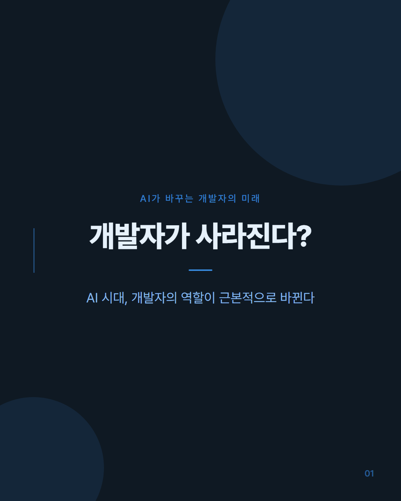
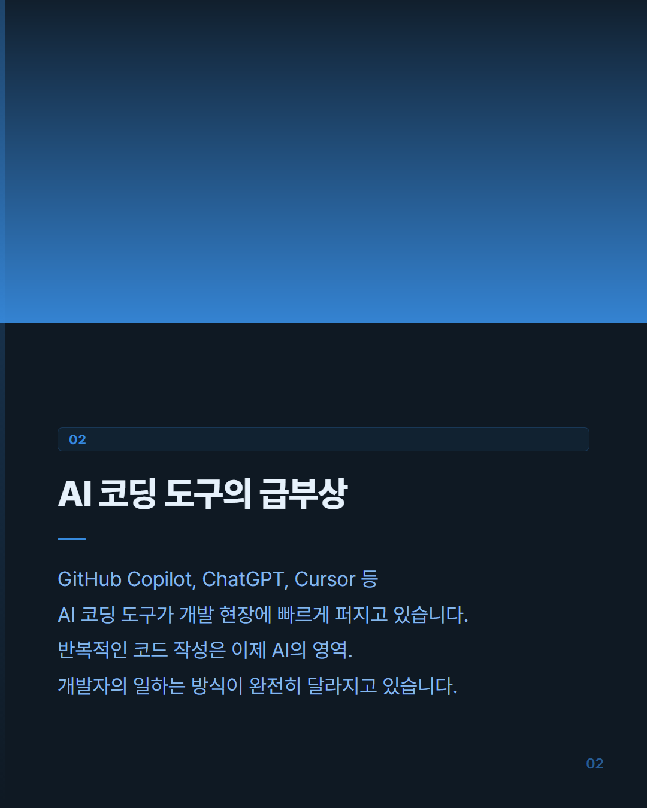
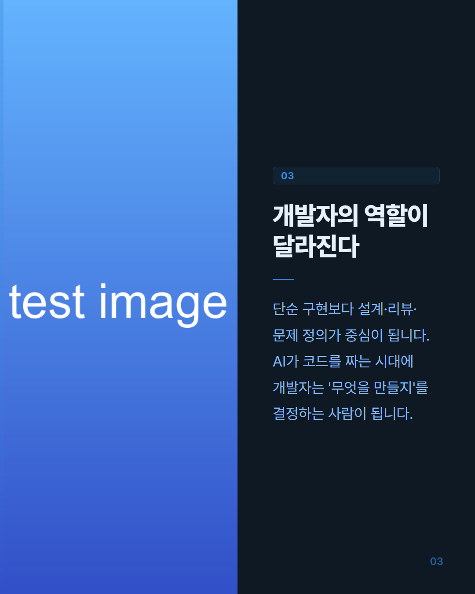
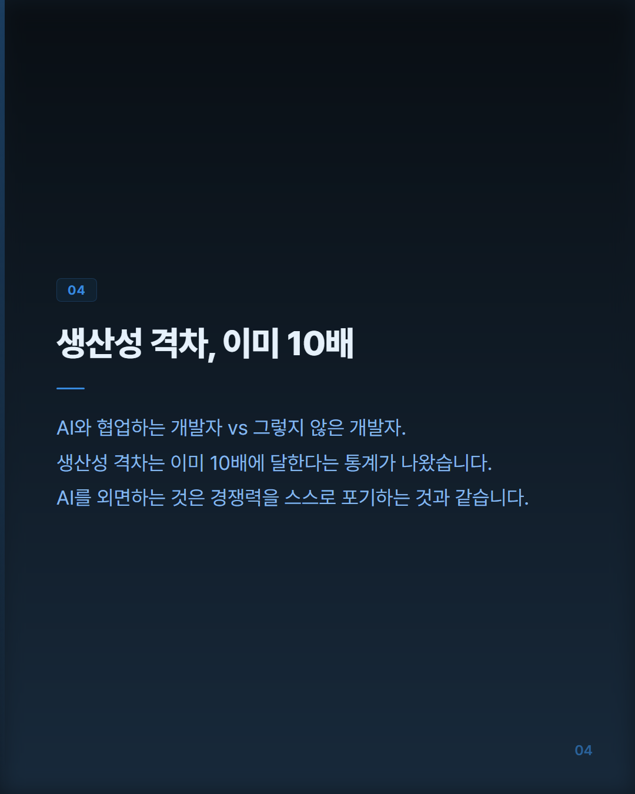
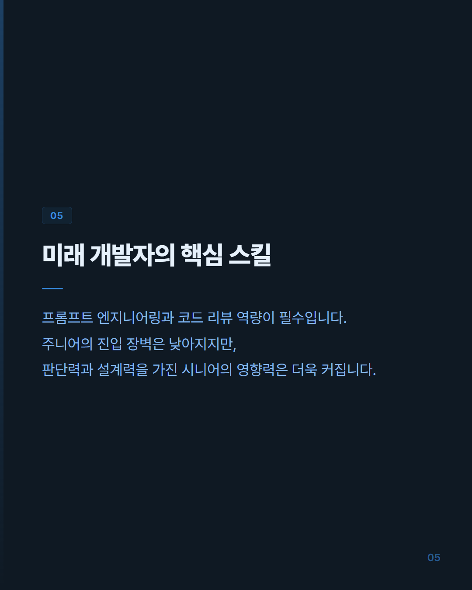
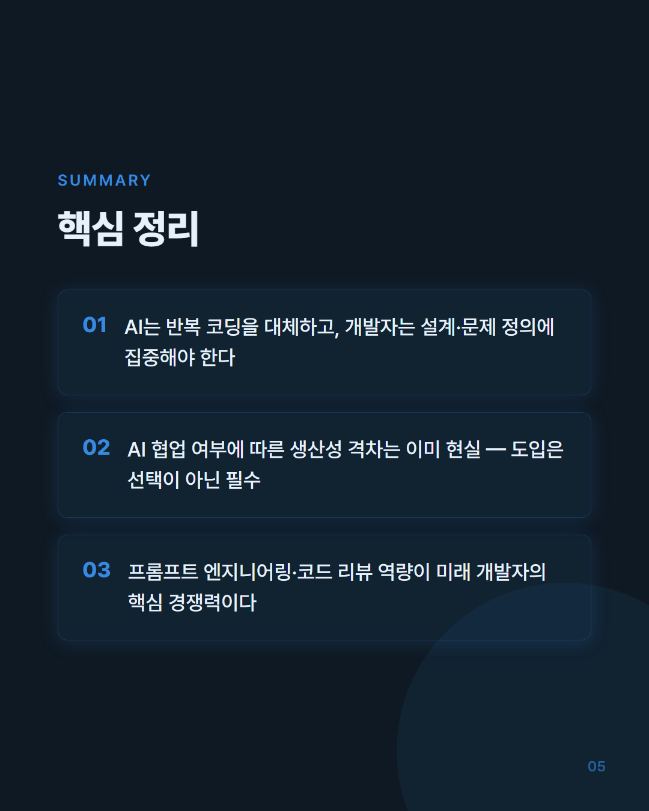
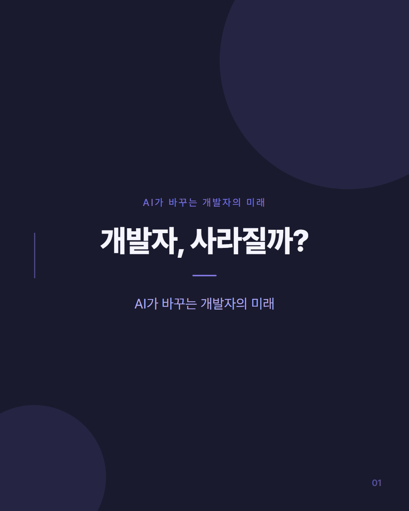

# Instagram Card News Automation

Claude Code CLI + Playwright 기반 인스타그램 카드뉴스 자동 생성 파이프라인. 

<br>

> 테마: `tech` / 주제: AI가 바꾸는 개발자의 미래

| 커버 | 본문 1 | 본문 2 | 본문 3 |
|------|-------------------|----------------------|------------------------|
|  |  |  |  |

| 본문 4 | 요약 | CTA |
|--------------------|------|-----|
|  |  |  |

<br>

## 1. 주요 기능
- 웹 UI — 브라우저에서 이미지 업로드 · 테마 선택 · 미리보기 · PNG 다운로드까지 한 화면에서 처리 (로컬 서버)
- 슬라이드 텍스트 자동 생성 — Claude Code CLI가 원문을 분석해 커버 훅 문구, 본문, 요약 텍스트를 JSON으로 생성
- Unsplash 이미지 자동 삽입 — Claude가 생성한 `image_query`로 Unsplash에서 이미지를 자동 검색·다운로드
- 이미지 혼용 지원 — `images/` 폴더에 직접 추가한 파일이 있으면 우선 사용, 없는 슬라이드만 Unsplash로 채움
- HTML 미리보기 — PNG 변환 전 브라우저에서 결과물을 먼저 확인
- 인터랙티브 재생성 — 미리보기 후 피드백을 입력하면 Claude가 반영해서 재생성 (반복 가능)
- HTML 직접 편집 지원 — output/html/ 파일을 직접 수정한 뒤 PNG로 변환
- 레이아웃 자동 선택 — 이미지 비율을 감지해 가로형은 밴드 레이아웃, 그 외는 전면 배경 레이아웃 적용
- 슬라이드 수 동적 조정 — 원문 분량에 따라 전체 슬라이드 6~8장 자동 결정
- 3가지 테마 — info (딥 퍼플) / life (웜 코럴) / tech (나이트 블루)
- 고해상도 PNG 캡처 — Playwright로 인스타그램 규격 1080×1350px 자동 캡처

<br>

## 2. 설치 및 실행방법

### 2-1. 사전 요구 사항

- Python 3.10+
- [Claude Code CLI](https://github.com/anthropics/claude-code) (`npm install -g @anthropic-ai/claude-code`)
- Claude Code 로그인 완료 (`claude` 명령어 실행 가능 상태)
- Unsplash 계정 및 Access Key (이미지 자동 삽입 시 필요, [Unsplash Developers](https://unsplash.com/developers) 에서 발급)

<br>

### 2-2. 설치

```bash
pip install -r requirements.txt
playwright install chromium
```

<br>

### 2-3. 환경변수 설정

Unsplash 이미지 자동 다운로드를 사용하려면 프로젝트 루트에 `.env` 파일을 생성하고 Access Key를 입력합니다.

```
UNSPLASH_ACCESS_KEY=여기에_키_입력
```

키를 설정하지 않아도 `images/` 폴더에 직접 파일을 추가하면 이미지를 사용할 수 있습니다.

<br>

### 2-4. 웹 UI로 사용하기

브라우저에서 이미지를 올리고, 테마를 고르고, 미리보기를 확인한 뒤 PNG를 내려받습니다.

```bash
python run_web.py
```

`http://127.0.0.1:8000` 이 자동으로 열립니다. (`--port` / `--host` / `--no-browser` 옵션 지원)

**사용 순서**

1. **이미지 업로드** — 드래그&드롭 또는 클릭. **업로드 순서대로** 커버(1번) → 본문 슬라이드에 배치되며, 썸네일의 `←` `→` 로 순서를 바꿀 수 있습니다. 이미지를 올리지 않은 슬라이드는 텍스트 전용 레이아웃이 됩니다.
2. **테마 선택** — info / life / tech
3. **제목·본문 입력** 후 `카드뉴스 생성` — Claude가 슬라이드 텍스트를 만드는 데 20~40초 정도 걸립니다.
4. **미리보기 확인** — 실제 1080×1350 HTML을 그대로 축소해 보여주므로 최종 PNG와 픽셀 단위로 같습니다. 카드를 클릭하면 크게 볼 수 있습니다.
5. **피드백 재생성** — 마음에 들지 않으면 피드백을 입력해 다시 생성 (반복 가능)
6. **저장** — `저장 (PNG 다운로드)` 를 누르면 Playwright가 PNG로 캡처하고 ZIP으로 내려받습니다. 개별 PNG도 따로 받을 수 있습니다.

작업 산출물은 `runs/<작업ID>/` 아래에 격리 저장되며, 서버를 다시 켤 때 24시간이 지난 폴더는 자동 정리됩니다.

Unsplash 자동 채우기 체크박스는 `.env` 에 `UNSPLASH_ACCESS_KEY` 가 있을 때만 동작합니다.

<br>

### 2-5. CLI로 사용하기

```bash
python main.py --theme <테마> --topic <주제> --text <원문>
```

| 옵션 | 필수 | 설명 |
|------|------|------|
| `--theme` | ✓ | `info` / `life` / `tech` |
| `--topic` | ✓ | 카드뉴스 제목 / 주제 |
| `--text`  | ✓ | 슬라이드 생성에 사용할 원문 |
| `--unsplash-key` | — | Unsplash Access Key (`.env` 설정 시 생략 가능) |
| `--render-only` | — | `output/slide_data.json` 으로 HTML 재렌더링 (PNG 변환 없음, `--theme` 필요) |
| `--capture-only` | — | `output/html/` 의 HTML을 **그대로** PNG로 변환 (렌더링 없음) |

`--render-only` 와 `--capture-only` 는 모두 Claude 호출과 Unsplash 다운로드를 건너뛰지만, HTML을 다시 만드는지가 다릅니다.

| | HTML 재렌더링 | PNG 변환 | 반영되는 수정 |
|---|---|---|---|
| `--render-only` | O | X | `slide_data.json` 의 텍스트, `templates/`, `themes/` |
| `--capture-only` | X | O | `output/html/` 을 직접 편집한 내용 |

두 옵션은 이어서 쓰도록 만들어졌습니다. `--render-only` 로 HTML을 다시 만들어 브라우저에서 확인한 뒤, 마음에 들면 `--capture-only` 로 PNG를 뽑습니다.

템플릿이나 테마 CSS를 고쳤다면 `--capture-only` 로는 반영되지 않습니다 — `--render-only` 를 쓰세요.

<br>

### 2-6. 테마

| `info` | `life` | `tech` |
|--------|--------|--------|
|  |  |  |
| 딥 퍼플 #1A1A2E / #7F77DD | 웜 코럴 #FFF8F5 / #D85A30 | 나이트 블루 #0F1923 / #378ADD |

<br>

### 2-7. 이미지 사용

이미지 소스는 두 가지를 혼용할 수 있으며, 모두 `images/` 폴더 하나로 통합 관리됩니다.

**직접 추가**: `images/` 폴더에 슬라이드 인덱스에 맞게 파일을 넣으면 해당 슬라이드에 우선 적용됩니다. Unsplash 키 없이도 동작합니다.

```
images/
  slide1.jpg   # 커버에 적용
  slide3.png   # 본문 슬라이드 3에 적용 (.png / .webp 도 가능)
```

**Unsplash 자동**: `.env`에 키를 설정하면 `images/`에 파일이 없는 슬라이드 중 Claude가 `image_query`를 생성한 슬라이드를 Unsplash에서 자동으로 채웁니다.

슬라이드별 이미지 결정 우선순위:

```
images/slideN.* 있음  →  직접 추가한 파일 사용
없음 + Unsplash 키 있음 + image_query 있음  →  Unsplash 자동 다운로드
없음 + 그 외  →  텍스트 전용
```

이미지 비율에 따라 레이아웃이 자동 선택됩니다. 커버와 본문 모두 같은 규칙을 씁니다.

| 비율 (가로/세로) | 레이아웃 | 구성 |
|------------------|---------|------|
| >= 1.5 (가로형) | `image-band-blur` | 1080px 풀블리드 이미지 밴드 → 그 아래 텍스트 |
| < 1.5 (정방형·세로형) | `image-blur-bg` | 이미지를 카드 전면에 깔고 어둡게 눌러 그 위에 텍스트 |
| 이미지 없음 | `text-only` | 텍스트만 |

#### `image-band-blur`

가로 이미지는 1080px 폭을 그대로 쓰고 세로만 잘라내 크롭 손실을 줄입니다. 카드 전체에는 같은 이미지를 흐리게(`blur(56px)`) 깔아 밴드 위아래 여백을 채우고, 그 위에 아래로 갈수록 짙어지는 스크림을 덮습니다.

```
상단 띠      흐린 이미지 (스크림 0.15)
이미지 밴드   선명, 1080px 폭 · 높이 가변
텍스트 영역   흐린 이미지 (스크림 0.55 → 0.85)
```

밴드 높이는 `flex` 로 남는 세로 공간을 흡수해 400~720px 사이에서 유동합니다. 상한 720px 은 가로형 판정 하한(1.5:1) 이미지가 크롭 없이 들어가는 높이입니다. 덕분에 본문 분량이 달라져도 마지막 텍스트의 바닥은 항상 하단 96px 지점에 놓여 `image-blur-bg` 슬라이드와 정렬이 맞습니다.

커버와 본문의 차이는 밴드 아래 여백뿐입니다 — 커버 96px, 본문 64px.

배경이 밝은 `life` 테마는 텍스트가 사진 위에 놓이므로 [themes/life.css](themes/life.css) 에서 제목·본문·슬라이드 번호를 밝은 색으로 뒤집습니다.

<br>

### 2-8. 사용 예시

```bash
python main.py \
  --theme info \
  --topic "AI가 바꾸는 개발자의 미래" \
  --text "최근 GitHub Copilot, ChatGPT 등 AI 코딩 도구가 급속히 보급되면서..."
```

<br>

## 3. 실행 흐름

```
[1/3]   Claude API로 슬라이드 텍스트 생성
[1.5/3] 이미지 준비 (직접 추가 파일 우선 → 나머지 Unsplash 자동 다운로드)
[2/3]   HTML 슬라이드 렌더링 → 브라우저 미리보기

PNG로 변환하시겠습니까?
  [y] PNG 변환
  [r] 다시 생성 (Claude에게 피드백)
  [e] HTML 직접 수정 후 변환
  [n] 취소

[3/3]   Playwright PNG 캡처 → output/ 저장
```

| 선택 | 동작 |
|------|------|
| `y` | PNG 변환 후 `output/` 에 저장 |
| `r` | 피드백을 입력하면 Claude가 반영해서 재생성, 이미지도 재준비 후 미리보기 다시 열림 |
| `e` | `output/html/` 의 HTML 파일을 직접 편집 후 엔터를 누르면 PNG 변환 |
| `n` | HTML은 `output/html/` 에 보관, PNG 변환 없이 종료 |

<br>

### 나중에 다시 PNG로 변환

이미 생성해둔 결과물을 Claude 재호출 없이 다시 PNG로 뽑을 수 있습니다.

`output/html/` 의 HTML을 직접 편집한 뒤 그대로 변환:

```bash
python main.py --capture-only
```

템플릿·테마를 고쳤거나 `slide_data.json` 의 텍스트를 손봤다면 재렌더링이 필요합니다:

```bash
python main.py --render-only --theme tech   # HTML 재생성 + 미리보기
python main.py --capture-only               # 확인 후 PNG 변환
```

`--render-only` 는 HTML을 만들고 브라우저 미리보기를 연 뒤 종료합니다. PNG는 만들지 않으므로, 결과를 확인하고 레이아웃을 더 손볼 여지를 둡니다.

<br>


## 4. 슬라이드 구성

원문 분량에 따라 전체 슬라이드 수가 6~8장으로 자동 조정됩니다.

| 슬라이드 | 종류 | 설명 |
|---------|------|------|
| 01 | 커버 | 훅 문구 + 부제목 |
| 02-04 / 02-05 / 02-06 | 본문 | 제목 + 본문, 원문 분량에 따라 3~5장 |
| N | 요약 | 핵심 요점 3가지 |
| N+1 | CTA | 고정 (팔로우 유도) |

| 본문 장수 | 전체 슬라이드 수 |
|----------|--------------|
| 3장 (02~04) | 6장 |
| 4장 (02~05) | 7장 |
| 5장 (02~06) | 8장 |

<br>

## 5. 프로젝트 구조

```
.
├── main.py            # CLI 진입점
├── run_web.py         # 웹 UI 로컬 서버 실행
├── web/
│   ├── app.py         # FastAPI 라우트 (업로드 · 생성 · 미리보기 · 내보내기)
│   ├── jobs.py        # 잡 저장소 + 워커 스레드
│   └── static/        # 프런트엔드 (index.html · app.js · style.css)
├── generator.py       # Claude Code CLI로 슬라이드 텍스트 생성
├── image_fetcher.py   # Unsplash 이미지 다운로드
├── renderer.py        # Jinja2 HTML 렌더링 + 레이아웃 선택
├── capture.py         # Playwright PNG 캡처
├── images/            # 이미지 소스 폴더 (직접 추가 + Unsplash 다운로드)
├── templates/
│   ├── cover.html
│   ├── body.html
│   ├── summary.html
│   └── cta.html
├── themes/
│   ├── info.css
│   ├── life.css
│   └── tech.css
├── .env               # Unsplash API 키 (gitignore 적용)
├── output/            # CLI 산출물
│   ├── html/          # 렌더링된 HTML 중간 결과물
│   └── slide_01.png   # 최종 PNG (자동 생성)
├── runs/              # 웹 UI 산출물 (작업별로 격리, 24시간 뒤 자동 정리)
│   └── <작업ID>/
│       ├── images/    # 업로드한 이미지
│       ├── html/      # 렌더링된 HTML
│       └── png/       # 캡처된 PNG + ZIP
└── requirements.txt
```
